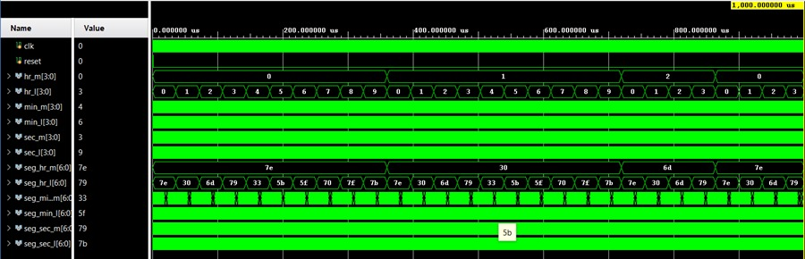

# Real Time Clock (RTC) - Verilog

## Overview

This project implements a 24-hour Real Time Clock (RTC) using Verilog HDL.
The design tracks hours, minutes, and seconds using cascaded counters and displays time in HH:MM:SS format through seven-segment decoding.

---

## Features

* 24-hour time format (00:00:00 to 23:59:59)
* Cascaded counter-based design for seconds, minutes, and hours
* Automatic rollover handling (23:59:59 → 00:00:00)
* Seven-segment display decoding for real-time output
* Verilog testbench for functional verification

---

## Design Details

* Separate counters for:

  * Seconds (00–59)
  * Minutes (00–59)
  * Hours (00–23)
* Sequential logic driven by clock and asynchronous reset
* Rollover logic implemented using nested conditional checks
* Seven-segment decoder converts 4-bit values into display signals

---

## Testbench

* Generates clock signal using periodic toggling
* Applies reset to initialize the system
* Uses `$monitor` to observe time progression and signal outputs
* Verifies correct increment and rollover behavior of counters

---

## Simulation

* Simulated using Vivado / QuestaSim
* Output confirms correct time sequencing and display decoding
* Waveform verifies proper counter transitions and rollover logic

---

## Tools Used

* Verilog HDL
* Xilinx Vivado
* QuestaSim

---

## Key Learning

* Counter-based sequential design
* Time sequencing and rollover logic
* Seven-segment display interfacing
* Functional verification using testbench simulation

---

## Waveform

---

## Author

Kotha Datta Sasank
